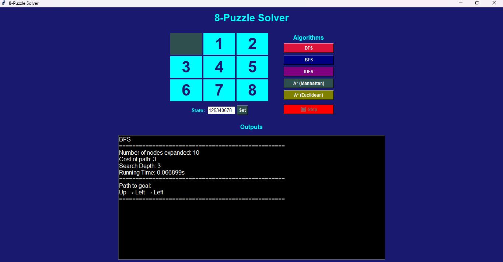

# 8-Puzzle Solver

This project implements an 8-puzzle solver using various search algorithms. The 8-puzzle is a sliding puzzle that consists of a frame of numbered square tiles in random order with one tile missing. The goal is to rearrange the tiles into a specific order by sliding them into the blank space.


## Features

- Implementation of four search algorithms: BFS, DFS, IDFS, and A* Search
- Comparison of algorithms based on performance metrics
- Tkinter-based GUI for visualization and interaction
- Support for custom initial puzzle states

## Algorithms

### Breadth-First Search (BFS)
- Explores the state space level by level
- Guarantees the shortest path solution
- High memory usage due to storing all nodes at each level

### Depth-First Search (DFS)
- Explores one path as deeply as possible
- Low memory usage
- May not find the optimal solution

### Iterative Deepening DFS (IDFS)
- Combines DFS with increasing depth limits
- Finds the shortest solution like BFS
- Better memory efficiency than BFS

### A* Search
- Uses heuristics to guide the search
- Finds optimal solutions efficiently
- Supports two heuristics: Manhattan Distance and Euclidean Distance

## Heuristics (for A*)

- **Manhattan Distance**: Calculates the sum of absolute differences in row and column positions. Best heuristic for 8-puzzle.
- **Euclidean Distance**: Calculates the straight-line distance between tiles. Less accurate but still effective.

## Assumptions

- Puzzle states are hashable and can be stored in sets/dictionaries
- The puzzle is solvable (even number of inversions)
- The state space is finite

## Installation

1. Ensure Python 3.x is installed on your system.
2. Clone the repository:
   ```
   git clone https://github.com/M7md5ald/8-Puzzle.git
   ```
3. Navigate to the project directory:
   ```
   cd 8-Puzzle
   ```

## Usage

### Running the GUI
To visualize and solve puzzles interactively:
```
python Lab1/gui.py
```

### Command Line Usage
You can also run individual algorithms from the command line by modifying `main.py` or using the classes directly.

## Project Structure

- `Lab1/`: Main source code directory
  - `astar.py`: A* Search implementation
  - `bfs.py`: Breadth-First Search implementation
  - `dfs.py`: Depth-First Search implementation
  - `idfs.py`: Iterative Deepening DFS implementation
  - `gui.py`: Tkinter GUI application
  - `main.py`: Main entry point
  - `puzzle.py`: Puzzle state representation
  - `search.py`: Base search class

